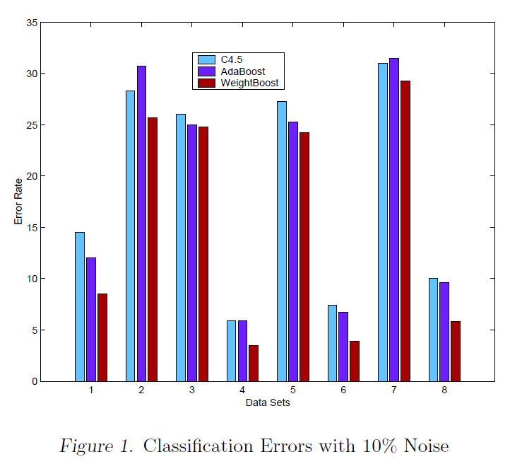

# A New Boosting Algorithm Using Input-Dependent Regularizer

**Authors:** Rong Jin, Yan Liu, Luo Si, Jaime Carbonell, Alexander G. Hauptmann  
**Institution:** School of Computer Science, Carnegie Mellon University, Pittsburgh, PA 15213-8213, USA  
**Conference:** Proceedings of the Twentieth International Conference on Machine Learning (ICML-2003), Washington DC, 2003

## Abstract

AdaBoost has proved to be an effective method to improve the performance of base classifiers both theoretically and empirically. However, previous studies have shown that AdaBoost might suffer from the overfitting problem, especially for noisy data. In addition, most current work on boosting assumes that the combination weights are fixed constants and therefore does not take particular input patterns into consideration. In this paper, we present a new boosting algorithm, "WeightBoost", which tries to solve these two problems by introducing an input-dependent regularization factor to the combination weight. Similarly to AdaBoost, we derive a learning procedure for WeightBoost, which is guaranteed to minimize training errors. Empirical studies on eight different UCI data sets and one text categorization data set show that WeightBoost almost always achieves a considerably better classification accuracy than AdaBoost. Furthermore, experiments on data with artificially controlled noise indicate that the WeightBoost is more robust to noise than AdaBoost.

## 1. Introduction

As a generally effective algorithm to create a "strong" classifier out of a weak classifier, boosting has gained popularity recently. Boosting works by repeatedly running the weak classifier on various training examples sampled from the original training pool, and combining the base classifiers produced by the weak learner into a single composite classifier. AdaBoost has been theoretically proved and empirically shown to be an effective method to improve the classification accuracy. Through the particular weight updating procedure, AdaBoost is able to focus on those data points that have been misclassified in previous training iterations and therefore minimizes the training errors.

Since AdaBoost is a greedy algorithm and intentionally focuses on the minimization of training errors, there have been many studies on the issues of overfitting for AdaBoost (Quinlan, 1996; Grove & Schuurmans, 1998; Ratsch et al., 1998). The general conclusion from early studies appears to be that in practice AdaBoost seldom overfits the training data; namely, even though the AdaBoost algorithm greedily minimizes the training errors via gradient descent, the testing error usually goes down accordingly. Recent studies have implied that this phenomenon might be related to the fact that the greedy search procedure used in AdaBoost is able to implicitly maximize the classification margin (Onoda et al., 1998; Friedman et al., 1998). However, other studies (Opitz & Macline, 1999; Jiang, 2000; Ratsch et al., 2000; Grove & Schuurmans, 1998; Dietterich, 2000) have shown that AdaBoost might have the problem of overfitting, particularly when the data are noisy.

In fact, noise in the data can be introduced by two factors, either the mislabelled data or the limitation of the hypothesis space of the base classifier. When noise level is high, there could be some data patterns that are difficult for the classifiers to capture. Therefore, the boosting algorithm is forced to focus on those noisy data patterns and thereby distort the optimal decision boundary. As a result, the decision boundary will only be suitable for those difficult data patterns and not necessarily general enough for other data. The overfitting problem can also be analyzed from the viewpoint of generalized error bound (Ratsch et al., 2000). As discussed in (Ratsch et al., 2000), the margin maximized by AdaBoost is actually a "hard margin", namely the smallest margin of those noisy data patterns. As a consequence, the margin of the other data points may decrease significantly when we maximize the "hard margin" and thus force the generalized error bound (Schapire, 1999) to increase.

In order to deal with the overfitting problems in AdaBoost, several strategies have been proposed, such as smoothing (Schapire & Singer, 1998), Gentle Boost (J. Friedman & Tibshirani, 1998), BrownBoost (Freund, 2001), Weight Decay (Ratsch et al., 1998) and regularized AdaBoost (Ratsch et al., 2000). The main ideas of these methods can be summarized into two groups: one is changing the cost function such as introducing regularization factors into the cost function; the other is introducing a soft margin. The problem of overfitting for AdaBoost may be related to the exponential cost function, which makes the weights of the noisy data grow exponentially and leads to the overemphasis of those data patterns. The solution to this issue can be, either to introduce a different cost function, such as a logistic regression function in (Friedman et al., 1998), or to regularize the exponential cost function with a penalty term such as the weight decay method used in (Ratsch et al., 1998), or to introduce a different weighting function, such as BrownBoost (Freund, 2001). A more general solution is to replace the "hard margin" in AdaBoost with a "soft margin". Similar to the strategy used in support vector machine (SVM) algorithm (Cortes & Vapnik, 1995), the boosting algorithm with a soft margin is able to allow a larger margin at the expense of some misclassification errors. This idea leads to works such as the regularized boosting algorithms using both linear programming and quadratic programming (Ratsch et al., 1999).

However, there is another problem with AdaBoost that has been overlooked in previous studies. The AdaBoost algorithm employs a linear combination strategy, that is, combining different base classifiers with a set of constants. As illustrated in previous studies, one advantage of the ensemble approach over a single model is that an ensemble approach allows each sub-model to cover a different aspect of the data set. By combining them together, we are able to explain the whole data set thoroughly. Therefore, in order to take full strength of each sub-model, a good combination strategy should be able to examine the input pattern and invoke the sub-models that are only appropriate for the input pattern. For example, in the Hierarchical Mixture Expert model (Jordan & Jacobs, 1994), the sub-models are organized into a tree structure, with leaf nodes acting as experts and internal nodes as "gates". Those internal nodes examine the patterns of the input data and route them to the most appropriate leaf nodes for classification. Therefore, for linear combination models, it seems more desirable to have those weighting factors dependent on the input patterns, namely given larger values if the associated sub-model is appropriate for the input pattern and smaller values otherwise. Unfortunately, previous work on additive models for boosting almost all assumes the combination weights as fixed constants, and therefore is not able to take the input patterns into account.

In order to solve the two problems pointed out above, i.e., overfitting and constant combination weights for all input examples, we propose a new boosting algorithm that combines the base classifiers using a set of input-dependent weighting factors. This new approach is able to alleviate the second problem because by those input-dependent weight factors, we are able to force each sub-model to focus on what it is good at. Meanwhile, we can show that those input-dependent factors can also alleviate the overfitting problem substantially. The reason is summarized as follows: in the common practice of boosting, a set of "weak" classifiers are combined with fixed constants. Therefore, for noisy data patterns, the error will accumulate through the sum and the weights of distribution will grow exponentially. In our work, we intentionally set the weighting factors of "weak classifiers" to be inverse to the previously accumulated weights, therefore we are able to significantly discount the weights of noisy data and alleviate the problem of overfitting.

The rest of the paper is arranged as follows: in Section 2 we discuss the related work on other boosting algorithms. The full description of our algorithm is presented in Section 3. The empirical study of our new algorithm versus the AdaBoost algorithm is described in Section 4. Finally, we draw conclusions and discuss future work.

## 2. Related Work

Since the AdaBoost algorithm is a greedy algorithm and intentionally focuses on minimizing the training errors, there have been many studies on the issue of overfitting for AdaBoost algorithm. However, most of the modification algorithms are unsuccessful either due to the high computational cost or lack of strong empirical results of improvement. One of the most successful algorithms is the Weight Decay method.

The basic idea of the Weight Decay method can be described as follows: in analogy to weight decay in neural networks, Ratsch et al. define $\zeta_i^1 = \left( \sum_{t=1}^t \alpha_t h_t(x_i) \right)^2$, where the inner sum $\zeta_i^1$ is the cumulative weight of the pattern in the previous iterations. Similar to the Support Vector Machines (Vapnik, 1995), they add $\zeta_i^1$ into the cost function as the "slack variables". The new cost function becomes:

$$
\epsilon^{\mathrm{f}} = \frac{1}{N} \left( \sum_{i=1}^N e^{\operatorname{sign}(-H(x_i) p_i) - C \zeta_i^{\mathrm{t}}} \right),
$$

where $C$ is a constant. Using this error function, we can control the tradeoff between the weights of training examples, that is, it will not change much for easily classifiable data points, but will change a lot for difficult patterns. The Weight Decay method has proved to achieve some improvement over the AdaBoost algorithm.

## 3. Description of Algorithm

### 3.1. Brief Review of the Derivation of AdaBoost Algorithm

In order to introduce our new boosting algorithm, we will first visit the proof of AdaBoost briefly, which has a direct impact on the derivation of the new algorithm. The particular derivation that we show basically follows the paper by Friedman et al. (Friedman et al., 1998).

In AdaBoost, we construct a new classifier $H(x)$ by the linear combination of the base classifier $h(x)$, i.e.

$$
H(x) = \sum_{t=1}^T \alpha_t h_t(x) = H_{T-1}(x) + \alpha_T h_T(x)
$$

where $\alpha_t$ is the linear combination coefficient for the $t_{th}$ basic classifier $h_t(x)$, and $H_{T-1}(x)$ is defined as $\sum_{t=1}^{T-1} \alpha_t h_t(x)$.

In order to obtain the optimal base classifiers $\{h_T(x)\}$ and linear combination coefficients $\{\alpha_T\}$, we need to minimize the training error. For binary classification problems, assume that the value of the class label takes either 1 or -1, and the training error for the classifier $H(x)$ can be written as $\text{err} = \sum_{i=1}^N \operatorname{sign}(-H(x_i) y_i) / N$. For the simplicity of computation, people usually use the exponential cost function as the objective function, namely $\sum_{i=1}^N e^{-H(x_i) y_i} / N$. Apparently, the exponential cost function upper bounds the training error $\text{err}$.

To minimize the exponential cost function, we use the inductive form for $H(x)$ in eq1 and rewrite the upper bound function for the training error as:

$$
\begin{aligned}
\text{err} &\leq \frac{1}{N} \sum_{i=1}^N e^{-H_T(x_i) y_i} \\
&= \frac{1}{N} \sum_{i=1}^N \left\{ e^{-H_{T-1}(x_i) y_i} e^{\alpha_T} I(h_T(x_i), y_i) \right. \\
&\quad \left. + e^{-H_{T-1}(x_i) y_i} e^{-\alpha_T} I(-h_T(x_i), y_i) \right\},
\end{aligned}
$$

where function $I$ is defined as:

$$
I(x_1, x_2) = \begin{cases}
1 & \text{if } x_1 = x_2 \\
0 & \text{if } x_1 \neq x_2
\end{cases}.
$$

By setting the derivative of the equation above with respect to $\alpha_T$ to be zero, we have the expression as follows:

$$
\alpha_T = \frac{1}{2} \ln \left( \frac{\sum_{i=1}^N e^{-H_{T-1}(x_i) y_i} I(h_T(x_i), y_i)}{\sum_{i=1}^N e^{-H_{T-1}(x_i) y_i} I(-h_T(x_i), y_i)} \right)
$$

Meanwhile, to minimize eq1, the classifier $h_T(x)$ needs to be optimized with respect to the following data distribution:

$$
W_i^T = \frac{e^{-H_{T-1}(x_i) y_i}}{\sum_{j=1}^N e^{-H_{T-1}(x_j) y_j}}.
$$

With the expression of data distribution $W_i^T$, the linear combination coefficient $\alpha_T$ can be rewritten as:

$$
\alpha_T = \frac{1}{2} \ln \left( \frac{\sum_{i=1}^N W_i^T I(h_T(x_i), y_i)}{\sum_{i=1}^N W_i^T I(-h_T(x_i), y_i)} \right) = \frac{1}{2} \ln \left( \frac{1 - \epsilon^T}{\epsilon^T} \right)
$$

where $\epsilon^T$ stands for the weighted error rate under the weight distribution $W^T$ for the base classifier $h_T(x)$ in iteration $T$.

In summary, the minimization of training error is accomplished through this stepwise optimization. In each iteration, we train a new base classifier according to the data distribution in eq2, and combine it with the previous base classifiers using the weight as described in eq3.

### 3.2. The New Boosting Algorithm: WeightBoost

The overfitting problem of AdaBoost can be implied by the weight updating function in eq2. For each iteration, the weight for the $i$th data point is proportional to the function $e^{-H_{T-1}(x_i) y_i}$. As we can see, $H_{T-1}(x)$ is a linear combination of all the base classifiers obtained from iteration 1 to iteration $T-1$. If there are some noisy data patterns that are difficult to be classified correctly by the base classifier, the value of $-H_{T-1}(x_i) y_i$ for those data points will accumulate linearly and thus the corresponding weights can grow exponentially. Therefore, the particular sampling procedure within the AdaBoost algorithm will overemphasize the noisy training data points and may lead to a complex decision boundary that is not well generalized. In this subsection, we present a new boosting algorithm, which combines base classifiers using input-dependent weighting factors instead of fixed coefficients. We will first discuss a special form of this idea since it is a more intuitive way to solve overfitting problems and then develop a more general form.

Since the overfitting problem is caused by the accumulation of errors within the function $H_{T-1}(x)$, one way to avoid this is to modify the expression form for $H_{T-1}(x)$. Instead of multiplying each base classifier with a simple constant $\alpha_t$, we can make the combination coefficients input-dependent, i.e.

$$
H_T(x) = \sum_{t=1}^T \alpha_t e^{-|\beta H_{t-1}(x)|} h_t(x).
$$

Compared with eq1, the above expression replaces the weighting constant $\alpha_t$ with $\alpha_t e^{-|\beta H_{t-1}(x)|}$. More interestingly, it can be shown easily that, under the condition that the weighting coefficients $\alpha_t$ are bounded by some fixed constant $\alpha_{\max}$, the value of $H_T(x)$ in eq4 will increase at most by the logarithmic degree with respect to the number of iterations $T$. More specifically, we have $H_T(x)$ bounded by the following expression:

$$
H_T(x) \leq \frac{1}{\beta} \ln \left( \beta \alpha_{\max} e^{\beta \alpha_{\max}} (T-1) + e^{\beta H_1(x)} \right)
$$

(detailed proof can be found in the Appendix). Therefore, the weight of each data pattern will grow at most polynomially with the number of iterations and as a result, the problem of overemphasizing noisy data patterns in AdaBoost can be alleviated substantially.

As pointed out before, another problem with the AdaBoost algorithm is that, by combining the base classifiers with fixed constants, the opinion of each classifier will always be weighted with the same number no matter what input patterns are. According to AdaBoost, each base classifier $h_t(x)$ is trained intentionally on the data patterns that are either misclassified or weakly classified by previous classifiers $H_{t-1}(x)$. Therefore, every base classifier $h_t(x)$ should be appropriate only for a subset of input patterns. However, in the prediction phase, the opinion of the base classifier $h_t(x)$ will always be weighted by the same number $\alpha_t$ no matter what the test examples are. On the contrary, in the new form of $H_T(x)$ in eq4, the introduction of the "instance-dependent factor" $e^{-|\beta H_{t-1}(x)|}$ in the combination coefficients offers us a way to make a tradeoff between the opinion of the base classifier $h_t(x)$ and that of the previously built meta-classifier $H_{t-1}(x)$. The value of $H_{t-1}(x)$ indicates its confidence in classifying the instance $x$, so the factor $e^{-|\beta H_{t-1}(x)|}$ can be interpreted as considering the opinion of $h_t(x)$ seriously only when previous classifiers $H_{t-1}(x)$ are not confident about their decision. In this way, the introduction of the "input-dependent factor" makes the base classifier $h_t(x)$ consistent between the training phase and the prediction phase, namely $h_t(x)$ is used for prediction on the particular type of input patterns that it has been trained on.

The factor $\beta$ within the "input-dependent factor" $e^{-|\beta H_{T-1}(x)|}$ is used to control to what extent the opinion of $H_{T-1}(x)$ should be considered seriously. When $\beta$ is set to be zero, the combination coefficient goes back to the simple form $\alpha_t$ and the combination form (in eq4) simply becomes eq1. In this sense, AdaBoost can be treated as a special case of eq4. When $\beta$ goes to infinity, the effect of the base classifier $h_t(x)$ is almost ignored and only the opinion of $H_{T-1}(x)$ is dominant.

Next, we need to obtain a learning procedure that is able to minimize the exponential cost function with the new combination form for $H_T(x)$. Following similar procedures for deriving the AdaBoost algorithm as we did in the previous subsection, we can get:

$$
\begin{aligned}
H_T(x) &= \sum_{t=1}^{T-1} \alpha_t e^{-|\beta H_{t-1}(x)|} h_t(x) + \alpha_T e^{-|\beta H_{T-1}(x)|} h_T(x) \\
&= H_{T-1}(x) + \alpha_T e^{-|\beta H_{T-1}(x)|} h_T(x)
\end{aligned}
$$

With this new inductive form for $H_T(x)$, we will have the upper bound function for the training error as:

$$
\begin{aligned}
\text{err} &\leq \frac{1}{N} \sum_{i=1}^N e^{-H_T(x_i) y_i} \\
&= \frac{1}{N} \sum_{i=1}^N e^{-H_{T-1}(x_i) y_i} e^{-\alpha_T e^{-|\beta H_{T-1}(x_i)|} h_T(x_i) y_i} \\
&= \frac{1}{N} \sum_{i=1}^N \left\{ e^{-H_{T-1}(x_i) y_i} e^{-\alpha_T e^{-|\beta H_{T-1}(x_i)|}} I(h_T(x_i), y_i) \right. \\
&\quad \left. + e^{-H_{T-1}(x_i) y_i} e^{\alpha_T e^{-|\beta H_{T-1}(x_i)|}} I(-h_T(x_i), y_i) \right\}.
\end{aligned}
$$

Since $e^{-|\beta H_{T-1}(x)|}$ is between 0 and 1, we can have $\exp(\alpha_T e^{-|\beta H_{T-1}(x)|})$ upper bounded by the following expression:

$$
\exp(\alpha_T e^{-|\beta H_{T-1}(x)|}) \leq 1 + (e^{\alpha_T} - 1) e^{-|\beta H_{T-1}(x)|}.
$$

Similarly,

$$
\exp(-\alpha_T e^{-|\beta H_{T-1}(x)|}) \leq 1 + (e^{-\alpha_T} - 1) e^{-|\beta H_{T-1}(x)|}.
$$

Then, eq5 can be rewritten as:

$$
\begin{aligned}
\text{err} &\leq \frac{1}{N} \sum_{i=1}^N \left\{ e^{-H_{T-1}(x_i) y_i} e^{-\alpha_T e^{-|\beta H_{T-1}(x_i)|}} I(h_T(x_i), y_i) \right. \\
&\quad \left. + e^{-H_{T-1}(x_i) y_i} e^{\alpha_T e^{-|\beta H_{T-1}(x_i)|}} I(-h_T(x_i), y_i) \right\} \\
&\leq \frac{1}{N} \sum_{i=1}^N \left\{ e^{-H_{T-1}(x_i) y_i} e^{-\alpha_T} e^{-|\beta H_{T-1}(x_i)|} I(h_T(x_i), y_i) \right. \\
&\quad \left. + e^{-H_{T-1}(x_i) y_i} e^{\alpha_T} e^{-|\beta H_{T-1}(x_i)|} I(-h_T(x_i), y_i) \right\} \\
&\quad + \frac{1}{N} \sum_{i=1}^N e^{-H_{T-1}(x_i) y_i} (1 - e^{-|\beta H_{T-1}(x_i)|}).
\end{aligned}
$$

Similar to the derivation stated in the previous subsection, we set the derivative of eq6 with respect to $\alpha_T$ to be zero, which leads to the expression form for $\alpha_T$ as:

$$
\alpha_T = \frac{1}{2} \ln \left( \frac{\sum_{i=1}^N e^{-H_{T-1}(x_i) y_i - |\beta H_{T-1}(x_i)|} I(h_T(x_i), y_i)}{\sum_{i=1}^N e^{-H_{T-1}(x_i) y_i - |\beta H_{T-1}(x_i)|} I(-h_T(x_i), y_i)} \right).
$$

By defining the updating functions $W_i^T$ as:

$$
W_i^T = \frac{e^{-H_{T-1}(x_i) y_i - |\beta H_{T-1}(x_i)|}}{\sum_{j=1}^N e^{-H_{T-1}(x_j) y_j - |\beta H_{T-1}(x_j)|}},
$$

we will get the exact same expression for $\alpha_T$ as in eq3, i.e.

$$
\alpha_T = \frac{1}{2} \ln \left( \frac{\sum_{i=1}^N W_i^T I(h_T(x_i), y_i)}{\sum_{i=1}^N W_i^T I(-h_T(x_i), y_i)} \right) = \frac{1}{2} \ln \left( \frac{1 - \epsilon^T}{\epsilon^T} \right),
$$

where $\epsilon^T$ stands for the weighted error for the classifier $h_T(x)$ in the $T_{th}$ training iteration.

In summary, the procedures for the WeightBoost algorithm are similar to those of AdaBoost. For each training iteration, we update the weight of each data point using eq7, then train a new base classifier with the weighted training data, and finally combine the new base classifier with the previous ones with the weight expressed in eq8.

Compared with the AdaBoost algorithm, the only difference is the weight updating function, which is defined in eq7. In the original AdaBoost algorithm, the weight for instance $x_i$ is proportional to $e^{-H_{T-1}(x_i) y_i}$, and therefore only instances that are misclassified by the previously obtained classifier $H_{T-1}(x_i)$ will be emphasized in the next round of training. As indicated in eq7, in the new boosting algorithm, the weight for instance $x_i$ is proportional to $e^{-H_{T-1}(x_j) y_j - |\beta H_{T-1}(x_j)|}$. With this additional term $|\beta H_{T-1}(x_j)|$ within the exponential function, not only the data points misclassified by classifier $H_{T-1}(x)$, but also the data points close to the decision boundary of classifier $H_{T-1}$ will be emphasized in the next training round. Therefore, the modified weight updating function in eq7 is able to achieve the tradeoff between the goal of minimizing the training errors and the goal of maximizing the classification margin. This is similar to the concept of minimizing classification risk in Support Vector Machine (SVM) (Cortes & Vapnik, 1995; Vapnik, 1995) and regularized boosting algorithms (Ratsch et al., 2000). Furthermore, by adjusting the constant $\beta$, we are able to control the balance between these two different goals.

### 3.3. More General Solution

In eq4, we restrict ourselves to the specific combination form by using the term $e^{-|H_{T-1}(x_i)|}$ as the "input-dependent regularizer". In fact, the derivation of the learning algorithm in the previous section is applicable to any regularization function as long as it is bounded between 0 and some fixed non-negative constant. Let $f(x)$ stand for the chosen regularizer. Then $H_T(x)$ is written as:

$$
H_T(x) = \sum_{t=1}^T \alpha_t f(x) h_t(x).
$$

Assume that the value of function $f(x)$ is between 0 and $f_{\max}$, by defining $\alpha_t' = \alpha f_{\max}$ and $g(x) = f(x) / f_{\max}$, we have $H_T(x)$ rewritten as:

$$
H_T(x) = \sum_{t=1}^T \alpha_t' g(x) h_t(x).
$$

Since the function $g(x)$ is bounded between 0 and 1, which is the same as $e^{-|\beta H_T(x)|}$, all the results derived in the previous section will be correct for function $g(x)$. Thus, for regularization function $f(x)$, the updating function becomes:

$$
W_i^T = \frac{e^{-H_{T-1}(x_i) y_i} f(x_i) / f_{\max}}{\sum_{j=1}^N e^{-H_{T-1}(x_j) y_j} f(x_j) / f_{\max}}
$$

and the weighting coefficient $\alpha_T$ is:

$$
\alpha_T = \frac{f_{\max}}{2} \ln \left( \frac{1 - \epsilon^T}{\epsilon^T} \right).
$$

One problem with simply using $e^{-|\beta H_{T-1}(x_j)|}$ as the "input-dependent regularizer" is that the value of this function may become too small if the value of $|\beta H_{T-1}(x_j)|$ is large. This may discount the opinion of the base classifier $h_T(x)$ too much. One solution would be replacing the function $e^{-|\beta H_{T-1}(x_j)|}$ with $e^{-|\beta H_{T-1}(x_j)|} / C_T$. In our experiments, we set $C_T$ as the normalization factor, which is $\sum_i e^{-|\beta H_{T-1}(x_j)|} / 0.1 N$.

### 3.4. Comparison to the Weight Decay Method

The weight updating function in eq7 is somewhat similar to the one obtained via the Weight Decay method. However, there are two significant differences between these two methods:

1. In our algorithm, we did not modify the objective function. Instead, we modify the combination form by introducing an input-dependent regularizer for each weighting coefficient. Therefore, unlike the Weight Decay method, where the regularization is achieved by introducing a penalty term in the objective function, the regularization of WeightBoost is realized through the input-dependent regularizer.
2. Similar to other boosting algorithms, the Weight Decay method combines different base classifiers with a set of input-independent weights. In the WeightBoost algorithm, the weighting coefficients depend on the input patterns, which has the advantage of being able to direct testing instances to the appropriate base classifiers according to their input patterns.

## 4. Empirical Validation

As discussed before, there are two problems that our new algorithm tries to solve: the overfitting problem and constant weight combination. In the previous section, we have discussed how WeightBoost can tackle these two problems theoretically. Next, we will examine empirically whether our new algorithm performs better than others.

### 4.1. Standard Evaluation

In this subsection, we examine the general effectiveness of the WeightBoost algorithm by comparing it with AdaBoost and the Weight Decay method. Eight data sets from the UCI repository (Blake & Merz, 1998) and a benchmark of text categorization evaluation, the ApteMod version of the Reuters-21578 corpus, are used as testbeds. All of the UCI data sets are binary classification problems, and the detailed information is listed in Table 1. The Reuters-21578 corpus consists of a training set of 7,769 documents and a test set of 3,019 documents with 90 categories, each of which has at least one occurrence in both sets. The number of categories per document is 1.3 on average. In order to deal with the multiple classes, we decompose the multiple-class classification into a set of binary classification problems using the standard one-against-all approach.

The base classifier we used in our experiment is the decision tree C4.5 (Quinlan, 1993), which is commonly used for evaluating boosting algorithms in previous studies (Schapire, 1999; Quinlan, 1996). For all UCI data sets, we set the maximum training iteration to be 100 as Freund did in their experiments (Freund & Schapire, 1996) and reported the results via averaged 10-fold cross-validation. The parameter $\beta$ in the WeightBoost algorithm is set to be 0.5 for all the data sets. We use the results of the decision tree C4.5 without any boosting algorithm as the baseline of our comparison.

**Table 1. Description of Data Sets**

| Collection Name       | Num of Instances | Num of Attributes |
|-----------------------|------------------|-------------------|
| Ionosphere            | 351              | 34                |
| German                | 1000             | 20                |
| Pima Indians Diabetes | 768              | 8                 |
| Breast Cancer         | 268              | 9                 |
| wpbe                  | 198              | 30                |
| wdbc                  | 569              | 30                |
| Contraceptive         | 1473             | 10                |
| Spambase              | 4601             | 58                |

**Table 2. Classification Errors for WeightBoost, AdaBoost, and Weight Decay**

| Collection Name       | C4.5  | AdaBoost | Weight Decay | $\epsilon$-Boost | WeightBoost |
|-----------------------|-------|----------|--------------|----------------|-------------|
| Ionosphere            | 9.1%  | 6.3%     | 5.7%         | 6.8%           | 6.2%        |
| German                | 26.9% | 26.5%    | 25.7%        | 24.7%          | 24.7%       |
| Pima-Indians-Diabetes | 25.2% | 24.7%    | 25.1%        | 23.9%          | 22.6%       |
| Breast Cancer         | 5.4%  | 4.5%     | 3.7%         | 3.2%           | 3.3%        |
| wpbe                  | 28.8% | 26.3%    | 21.1%        | 21.1%          | 19.9%       |
| wdbc                  | 6.1%  | 3.5%     | 3.9%         | 3.7%           | 3.0%        |
| Contraceptive         | 31.5% | 31%      | 29.8%        | 30.4%          | 27.6%       |
| Spambase              | 7.2%  | 5.5%     | 4.9%         | 4.5%           | 4.2%        |

The error rates of the new boosting algorithm, AdaBoost, and the Weight Decay method on the eight UCI collections are listed in Table 2. From the table, we can see: first, WeightBoost is able to achieve lower classification errors than AdaBoost on all of the eight data sets and than Weight Decay on six out of eight. Secondly, for data sets such as "German", "Pima-Indians-Diabetes", and "Contraceptive", the classification errors of AdaBoost and Weight Decay are almost identical to the baseline results, while our new boosting algorithm is able to lower the error rate significantly. To further see if the improvements come from the input-dependent regularizer or simply due to the regularization on the value of $H(x)$, we compare WeightBoost to $\epsilon$-Boost, which is introduced by Friedman (Friedman et al., 1998). In this method, each weak classifier is given small weights, and therefore the value of the combined classifier will usually not be very large. The fourth column of Table 2 shows the results of $\epsilon$-Boost. Again, the proposed boosting algorithm outperforms $\epsilon$-Boost in seven out of eight data sets. Based on the above observations, the introduction of an input-dependent regularizer does help improve the effectiveness of the boosting algorithm.

To further demonstrate the effectiveness of WeightBoost, we test our method and AdaBoost on the Reuters-21578 corpus, a benchmark in recent text categorization evaluations. We pre-processed the documents, including down-casing, tokenization, removal of punctuation and stop words, and stemming. The resulting documents had a vocabulary of 24,240 unique words. We performed supervised feature selection using the $\chi^2_{\max}$ criterion, i.e., the maximum of $\chi^2$ over the 90 categories (Yang & Pedersen, 1997) by cross-validation, and the resulting vocabulary is 2,000. Document vectors based on these feature sets were computed using the SMART Re version of TF-IDF term weighting (Buckley et al., 1994). This gives term $t$ in document $d$ a weight of:

$$
w_d(t) = (1 + \log_2 n(t, d)) \times \log_2(|\mathcal{D}| / n(t)),
$$

where $n(t)$ is the number of documents that contain $t$. For the evaluation metric, we used a common effectiveness measure, $F_1$, defined to be: $F_1 = \frac{2rp}{r + p}$, where $p$ refers to the precision and $r$ represents the recall. We tuned the number of training iterations and reported the best results (the corresponding iterations are 25 and 10 respectively for WeightBoost and AdaBoost).

**Table 3. Classification Results of AdaBoost and WeightBoost on Reuters-21578 Corpus**

| Category | C4.5 F1 | AdaBoost F1 | Improvement | WeightBoost F1 | Improvement |
|----------|---------|-------------|-------------|----------------|-------------|
| Trade    | .5897   | .6634       | 12.5%       | .6949          | 17.8%       |
| Grain    | .9030   | .8814       | -2.4%       | .8966          | -0.7%       |
| Crude    | .8223   | .8204       | -0.2%       | .8587          | 4.4%        |
| Corn     | .8740   | .8926       | 2.1%        | .9091          | 4.0%        |
| Ship     | .8854   | .8857       | 7.8%        | .9275          | 4.0%        |
| Wheat    | .8804   | .8767       | -0.4%       | .9128          | 3.7%        |
| Acq      | .8915   | .9344       | 4.8%        | .9243          | 3.7%        |
| Interest | .6224   | .6747       | 8.4%        | .6352          | 2.1%        |
| Money-Fx | .6477   | .6805       | 5.1%        | .7041          | 8.7%        |
| Earn     | .9564   | .9698       | 1.4%        | .9707          | 1.5%        |

Table 3 shows the results of C4.5, AdaBoost, and WeightBoost on the ten most common categories of the Reuters corpus in terms of $F_1$ measurement and improvement over the baseline. It can be seen from the results that WeightBoost outperforms AdaBoost in seven out of the ten most common categories. For some categories, such as "Crude" and "Wheat", WeightBoost achieved impressive improvement over the baseline even though AdaBoost tends to overfit for those cases.

### 4.2. Robustness to Noise

In this subsection, we study the robustness of our new boosting algorithm by introducing noise to the data. Generally speaking, there are many kinds of noise in real applications. For our experiments, we choose labeling noise as the main focus since it can be controlled easily. We randomly select a part of the training examples and change their labels to the opposite ones while leaving the other examples the same as before. In this way, we obtained UCI data sets with 10%, 20%, and 30% noise and conducted the same experiments as in the previous subsection.

**Figure 1. Classification Errors with 10% Noise**

Figure 1 shows the comparison results of AdaBoost and WeightBoost on the eight UCI data sets with 10% noise. From the results, we can see that the AdaBoost algorithm did suffer from overfitting on some of the data sets, such as "German", "Breast-Cancer", and "Contraceptive", while WeightBoost consistently achieved improvement on all of the eight data sets. In addition, our new algorithm demonstrates great robustness to noise. For example, in the "wdbc" data set, WeightBoost got almost the same results for data with 10% noise (3.9% in Table 4) compared with the results without noise (3.0% in Table 2). Table 4 lists detailed results with different percentages of noise, and we can observe similar patterns as discussed above.

**Table 4. Classification Errors of AdaBoost and WeightBoost on UCI Data Sets with Introduced Noise (WB = WeightBoost)**

| Collection Name | 10% Noise |           |           | 20% Noise |           |           | 30% Noise |           |           |
|-----------------|-----------|-----------|-----------|-----------|-----------|-----------|-----------|-----------|-----------|
|                 | C4.5      | AdaBoost  | WB        | C4.5      | AdaBoost  | WB        | C4.5      | AdaBoost  | WB        |
| Ionosphere      | 14.50%    | 12.00%    | 8.50%     | 17.70%    | 16.80%    | 11.10%    | 26.50%    | 24.20%    | 19.90%    |
| German          | 28.30%    | 30.70%    | 25.70%    | 35.10%    | 32.90%    | 30.50%    | 42.80%    | 40.20%    | 35.80%    |
| Pima            | 26.00%    | 25.00%    | 24.80%    | 27.80%    | 26.00%    | 24.90%    | 31.30%    | 30.00%    | 26.20%    |
| Breast-Cancer   | 5.90%     | 5.90%     | 5.90%     | 5.90%     | 5.90%     | 4.10%     | 10.30%    | 10.80%    | 4.70%     |
| wpbe            | 27.30%    | 25.30%    | 24.20%    | 35.40%    | 35.00%    | 27.30%    | 31.30%    | 38.60%    | 34.10%    |
| wdbc            | 7.40%     | 6.70%     | 3.90%     | 7.00%     | 7.00%     | 5.30%     | 14.20%    | 14.20%    | 7.70%     |
| Contraceptive   | 31.00%    | 31.50%    | 29.30%    | 35.90%    | 35.90%    | 30.30%    | 30.20%    | 39.70%    | 34.50%    |
| Spambase        | 10.00%    | 9.60%     | 5.80%     | 11.10%    | 11.10%    | 7.00%     | 15.30%    | 13.30%    | 8.90%     |

## 5. Conclusion and Future Work

In this paper, we presented a new boosting algorithm with a different combination form from most previous works on boosting. By introducing an "input-dependent regularizer", we managed to route the testing examples to the appropriate base classifiers and at the same time solve overfitting problems. Furthermore, with the parameter $\beta$, we are able to balance the goal of minimizing training errors and the goal of maximizing margin. The new algorithm is able to outperform the AdaBoost algorithm on almost all eight different UCI data sets and a text categorization data set. Furthermore, we demonstrate that the new algorithm is much more robust to label noise than AdaBoost.

Future work involves conducting experiments with different "input-dependent regularizers". Since the exponential function may drop too rapidly, "slower" functions such as the inverse of polynomials could be better candidates. Moreover, more investigation is needed to discover how to automatically determine the value of $\beta$, which plays an important role in balancing the goal of minimizing the training error and that of maximizing margin.

## Appendix A

In this appendix, we will prove that, under the assumption that $\alpha_t$ is no more than $\alpha_{\max}$, the combination form eq4 will lead to the logarithmic bound for $H_T(x)$, namely $H_T(x) \leq \frac{1}{\beta} \ln \left( \beta \alpha_{\max} e^{\beta \alpha_{\max}} (T-1) + e^{\beta |H_1(x)|} \right)$. First, by taking the absolute value on both sides of eq4, we have:

$$
\begin{aligned}
|H_T(x)| &\leq |H_{T-1}(x)| + \alpha_T e^{-\beta |H_{T-1}(x)|} \\
&\leq |H_{T-1}(x)| + \alpha_{\max} e^{-\beta |H_{T-1}(x)|}
\end{aligned}
$$

and

$$
|H_{T-1}(x)| \geq |H_T(x)| - \alpha_{\max} e^{-\beta |H_{T-1}(x)|}.
$$

Substituting $H_{T-1}(x)$ in these two inequalities, we have:

$$
\begin{aligned}
|H_T(x)| &\leq |H_{T-1}(x)| + \alpha_{\max} e^{-\beta |H_T(x)| + \beta \alpha_{\max} e^{-\beta |H_{T-1}(x)|}} \\
&\leq |H_{T-1}(x)| + \alpha_{\max} e^{\beta \alpha_{\max}} e^{-\beta |H_T(x)|}.
\end{aligned}
$$

Now, we can prove by induction that the inequality:

$$
|H_T(x)| \leq \frac{1}{\beta} \ln \left( \beta \alpha_{\max} e^{\beta \alpha_{\max}} (T-1) + e^{\beta |H_1(x)|} \right)
$$

holds for any positive integer $T$:

First, for $T=1$, inequality eq16 is true because $H_1(x) \leq |H_1(x)|$. Then, for the induction step, assuming that the inequality holds for $T \leq k$, we need to prove it holds for $T = k+1$. It can be proved by contradiction. Assuming that inequality eq16 is wrong for $T = k+1$, we then have a lower bound for $|H_{k+1}(x)|$, i.e., $|H_{k+1}(x)| > \frac{1}{\beta} \ln \left( \beta \alpha_{\max} e^{\beta \alpha_{\max}} k + e^{\beta |H_1(x)|} \right)$. Combining it with the inequality in eq15, we will have an upper bound for $|H_{k+1}(x)|$, i.e.,

$$
\begin{aligned}
|H_{k+1}(x)| &\leq |H_k(x)| + \alpha_{\max} e^{-\beta |H_k(x)|} \\
&< \frac{1}{\beta} \ln \left( \beta \alpha_{\max} e^{\beta \alpha_{\max}} (k-1) + e^{\beta |H_1(x)|} \right).
\end{aligned}
$$

Putting the lower bound and the upper bound for $|H_{k+1}(x)|$, we have:

$$
\begin{aligned}
&\frac{1}{\beta} \ln \left( \beta \alpha_{\max} e^{\beta \alpha_{\max}} k + e^{\beta |H_1(x)|} \right) \\
&< \frac{1}{\beta} \ln \left( \beta \alpha_{\max} e^{\beta \alpha_{\max}} (k-1) + e^{\beta |H_1(x)|} \right) + \frac{\alpha_{\max} e^{\alpha_{\max}}}{e^{\beta |H_1(x)|} + \beta \alpha_{\max} e^{\alpha_{\max}} k}.
\end{aligned}
$$

With inequality $\ln(1 + x) \leq 1 + x$, we can easily see that the above inequality can't be true. Therefore, we have the induction step proved, which leads to the conclusion that for any $T$, inequality $|H_T(x)| \leq \frac{1}{\beta} \ln \left( \beta \alpha_{\max} e^{\beta \alpha_{\max}} (T-1) + e^{\beta H_1(x)} \right)$ holds.

## Acknowledgement

This work is partially supported by the National Science Foundation under Cooperative Agreement No. IRI-9817496, the National Science Foundation's National Science, Mathematics, Engineering, and Technology Education Digital Library Program under grant DUE-0085834, and by the Advanced Research and Development Activity (ARDA) under Contract No. MDA908-00-C-0037. This work is also funded in part by the National Science Foundation under their KDI program, Award No. SBR-9873009.

## References

- Blake, C., & Merz, C. (1998). *UCI repository of machine learning databases*.
- Buckley, C., Salton, G., & Allan, J. (1994). The effect of adding relevance information in a relevance feedback environment. *Proceedings of the 17th Ann Int ACM Conference on Research and Development in Information Retrieval* (pp. 292-300). London: Springer-Verlag.
- Cortes, C., & Vapnik, V. (1995). Support vector networks. *Machine Learning, 26*, 273-297.
- Dietterich, T. G. (2000). An experimental comparison of three methods for constructing ensembles of decision trees: Bagging, boosting, and randomization. *Machine Learning, 40*, 139-157.
- Freund, Y. (2001). An adaptive version of the boost by majority algorithm. *Machine Learning, 43*, 293-318.
- Freund, Y., & Schapire, R. E. (1996). Experiments with a new boosting algorithm. *International Conference on Machine Learning* (pp. 148-156).
- Friedman, J., Hastie, T., & Tibshirani, R. (1998). Additive logistic regression: a statistical view of boosting. *Dept. of Statistics, Stanford University Technical Report*.
- Grove, A. J., & Schuurmans, D. (1998). Boosting in the limit: Maximizing the margin of learned ensembles. *Proceedings of the Fifteenth National Conference on Artificial Intelligence* (pp. 692-699).
- J. Friedman, T. H., & Tibshirani, R. (1998). Additive logistic regression: a statistical view of boosting. *Report, Department of Statistics, Stanford University*.
- Jiang, W. (2000). Does boosting overfit: views from an exact solution. *Technical Report 00-04, Department of Statistics, Northwestern University*.
- Jordan, M. I., & Jacobs, R. A. (1994). Hierarchical mixtures of experts and the EM algorithm. *Neural Computation, 6*, 181-214.
- Onoda, T., Ratsch, G., & Muller, K. (1998). An asymptotic analysis of AdaBoost in the binary classification case. *Proceeding of the International Conference on Artificial Neural Networks*.
- Opitz, D., & Macline, R. (1999). Popular ensemble methods: An empirical study. *Journal of AI Research* (pp. 169-198).
- Quinlan, J. R. (1993). *C4.5: Programs for machine learning*. Morgan Kaufmann.
- Quinlan, J. R. (1996). Bagging, boosting, and C4.5. *Proceedings of the Thirteenth National Conference on Artificial Intelligence on Machine Learning*, 322-330.
- Ratsch, G., Onoda, T., & Muller, K. (1999). Regularizing AdaBoost. *Advances in Neural Information Processing Systems 11*.
- Ratsch, G., Onoda, T., & Muller, K. (2000). Soft margins for AdaBoost. *Machine Learning, 42*, 287-320.
- Ratsch, G., Onoda, T., & Muller, K. R. (1998). An improvement of AdaBoost to avoid overfitting. *Proc. of the Int. Conf. on Neural Information Processing* (pp. 506-509).
- Schapire, R. E. (1999). Theoretical views of boosting and applications. *Proc. Tenth International Conference on Algorithmic Learning Theory* (pp. 13-25). Springer-Verlag.
- Schapire, R. E., & Singer, Y. (1998). Improved boosting algorithms using confidence-rated predictions. *Computational Learning Theory* (pp. 80-91).
- Vapnik, V. (1995). *The nature of statistical learning theory*. New York: Springer-Verlag.
- Yang, Y., & Pedersen, J. (1997). A comparative study on feature selection in text categorization. *The Fourteenth International Conference on Machine Learning* (pp. 412-420). Morgan Kaufmann.