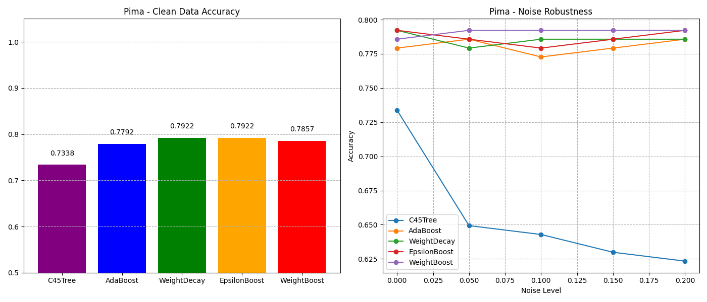

# WeightBoost: A Boosting Algorithm Using Input-Dependent Regularizer

COMP 7404 Project Presentation

|              |              |
|--------------|--------------|
| LI MINGYANG  | 3036371613   |
| YE HAO       | 3036371821   |

---

## Table of Contents
1. Introduction
2. Motivation
3. Algorithm Overview
4. Implemented Algorithms
  4.1 C4.5 Decision Tree
  4.2 AdaBoost
  4.3 Weight Decay
  4.4 ε-Boost
  4.5 WeightBoost

---

## Table of Contents (cont'd)
5. Datasets
  5.1 UCI Datasets
  5.2 Reuters Dataset
6. Experimental Setup
7. Results
8. Implementation Details
9. Theoretical Analysis
10. Conclusion
11. References

---

## Introduction

- Implementation of the WeightBoost algorithm from the paper "A New Boosting Algorithm Using Input-Dependent Regularizer" (Jin et al., 2003)
- Addresses two major limitations of AdaBoost:
  - **Overfitting Problem**: Overemphasis on hard-to-classify samples
  - **Fixed Weight Combination Problem**: Inability to adapt to input patterns

---

## Motivation

- AdaBoost has been highly successful but suffers from two key limitations:
  1. **Noise Sensitivity**: Exponentially increasing weights for misclassified samples can lead to overfitting on noisy data
  2. **Uniform Combination**: Each base classifier contributes equally across all regions of the input space

- WeightBoost introduces an **input-dependent regularizer** that:
  - Adapts the contribution of each classifier based on the input pattern
  - Reduces the influence of base classifiers in regions where the model is already confident
  - Provides better resistance to noisy data

---

## Algorithm Overview

- **Key Innovation**: Input-dependent regularizer
- **Mathematical Formulation**:
  - AdaBoost: $H(x) = \sum_{t=1}^{T} \alpha_t \cdot h_t(x)$
  - WeightBoost: $H_T(x) = \sum_{t=1}^{T} \alpha_t \cdot e^{-\beta|H_{t-1}(x)|} \cdot h_t(x)$

- **Benefits**:
  - Each base classifier contributes only in regions where it performs well
  - Regularization mitigates the impact of noisy data
  - Adaptive to different input patterns

---

## WeightBoost Algorithm

1. Initialize weights: $w_i = \frac{1}{n}$ for all samples
2. Initialize cumulative output: $H_0(x_i) = 0$ for all samples
3. For each iteration $t = 1, 2, ..., T$:
   - Train base classifier $h_t$ with weights $w$
   - Calculate weighted error: $\epsilon_t = \frac{\sum_{i=1}^{n} w_i \cdot \mathbb{1}(h_t(x_i) \neq y_i)}{\sum_{i=1}^{n} w_i}$
   - Compute classifier weight: $\alpha_t = \frac{1}{2} \ln\left(\frac{1-\epsilon_t}{\epsilon_t}\right)$
   - Update cumulative output: $H_t(x_i) = H_{t-1}(x_i) + \alpha_t \cdot h_t(x_i)$
   - Calculate regularization: $r_i = e^{-\beta \cdot |H_t(x_i)|}$
   - Update weights: $w_i = e^{-y_i \cdot H_t(x_i)} \cdot r_i$
   - Normalize weights: $w_i = \frac{w_i}{\sum_{j=1}^{n} w_j}$


---

## WeightBoost Implementation

```python
def fit(self, X, y):
    n_samples = X.shape[0]
    w = np.ones(n_samples) / n_samples  # Initialize weights
    H = np.zeros(n_samples)  # Cumulative classifier output
    
    for t in range(self.n_estimators):
        # Train base classifier
        model = clone(self.base_classifier)
        model.fit(X, y, sample_weight=w)
        
        # Calculate weighted error and model weight
        pred = model.predict(X)
        err = np.sum(w * (pred != y)) / np.sum(w)
        alpha = 0.5 * np.log((1 - err) / max(err, 1e-10))
        
        # Update cumulative output
        H += alpha * pred
        
        # Calculate regularization factor and update weights
        reg = np.exp(-np.abs(self.beta * H))
        w = np.exp(-y * H) * reg  # Apply regularization
        w = w / np.sum(w)  # Normalize
```

---

## Compared Implemented Algorithms
Following this paper, we implemented 4 algrithms for the comparison experiments part: C4.5 Decision Tree, Adaboost, Weight Decay and epsilon boost.

### 1. C4.5 Decision Tree

- **Base Classifier**: Extension of ID3 algorithm with improvements
- **Split Criterion**: Uses gain ratio instead of information gain
  - $\text{GainRatio}(S, A) = \frac{\text{Gain}(S, A)}{\text{SplitInfo}(S, A)}$
- **Features**:
  - Handles both continuous and discrete attributes
  - Deals with missing values
  - Implements pruning using pessimistic error estimation
  - Converts trees to rules for improved interpretability
- 

---
### 2. AdaBoost (Adaptive Boosting)

- **Original Algorithm**: Developed by Freund & Schapire (1996)
- **Key Idea**: Iteratively train weak learners with adjusted sample weights
- **Weight Update**: $w_i = w_i \cdot e^{-\alpha_t \cdot y_i \cdot h_t(x_i)}$
- **Final Classifier**: $H(x) = \text{sign}\left(\sum_{t=1}^{T} \alpha_t \cdot h_t(x)\right)$
- **Strengths**: Simple, effective, and theoretically sound
- **Limitations**: Sensitive to noisy data and outliers

---

### 3. Weight Decay

- **Variant of AdaBoost**: Adds regularization to mitigate overfitting
- **Key Innovation**: Introduces a regularization term to control the growth of weights
- **Weight Update**: $w_i = e^{-y_i \cdot H_t(x_i) - C \cdot \zeta_i}$
- **Regularization**: $\zeta_i = H_t(x_i)^2$ is a cumulative weight (slack variable)
- **Parameter C**: Controls the strength of the regularization (default: 0.1)
- **Benefit**: Helps prevent overfitting by penalizing large margins

---

### 4. ε-Boost (Epsilon Boost)

- **Simplified Variant**: Uses small fixed weights for base classifiers
- **Key Difference**: Uses a constant α (epsilon) instead of adaptive weights
- **Weight Calculation**: $\alpha_t = \epsilon$ (fixed small constant)
- **Parameter ε**: Typically set to a small value (default: 0.1)
- **Advantage**: Slower convergence but can lead to better generalization
- **Application**: Often used in gradient boosting frameworks
- **Trade-off**: Sacrifices rapid convergence for improved regularization

---


## Datasets

### 1. UCI Datasets

The UCI Machine Learning Repository provides widely-used public datasets for classification and regression tasks. Eight datasets were selected for binary classification:

<div style="font-size: 12px;">

| **Dataset**           | **Samples** | **Features** | **Description**                       |
|------------------------|-------------|--------------|---------------------------------------|
| Ionosphere            | 351         | 34           | Radar signal classification data      |
| German Credit         | 1000        | 20           | Credit risk assessment                |
| Pima Indians Diabetes | 768         | 8            | Diabetes diagnosis prediction         |
| Breast Cancer         | 286         | 9            | Tumor malignancy classification       |

</div>

---

<div style="font-size: 12px;">

| **Dataset**           | **Samples** | **Features** | **Description**                       |
|------------------------|-------------|--------------|---------------------------------------|
| wpbc                  | 198         | 30           | Breast cancer recurrence prediction   |
| wdbc                  | 569         | 30           | Breast cancer diagnostic data         |
| Contraceptive         | 1473        | 10           | Contraceptive method choice prediction|
| Spambase              | 4601        | 58           | Email spam classification             |

</div>

---

## Datasets

### 2. Reuters-21578 Dataset

- **Description**: Classic multi-label text classification dataset containing Reuters news articles
- **Size**: 10,788 news articles (7,769 training, 3,019 testing)
- **Classes**: 90 topic categories (multi-label)
- **Structure**: Each article contains:
  - Document ID (with train/test designation)
  - Categories (one or more topic labels)
  - Raw text content

---
### 2. Reuters-21578 Dataset

- **Characteristics**: 
  - Imbalanced class distribution
  - Multiple labels per document
  - Varying text lengths and complexity

---

## Datasets

### Reuters Dataset Preprocessing

- **Text Cleaning**:
  - Lowercase conversion
  - Punctuation removal
  - Stopword filtering using NLTK
  - Word stemming with Porter Stemmer

---  
### Reuters Dataset Preprocessing

- **Feature Extraction**:
  - TF-IDF vectorization (2,000 features)
  - Multi-label binarization for categories
  
- **Handling Imbalance**:
  - Focus on 10 most frequent categories for evaluation
  - Conversion to binary classification problems

---

## UCI Dataset Preprocessing

- Categorical feature encoding using OrdinalEncoder
- Missing value imputation using SimpleImputer
- Train/test split (80%/20%)
- Label noise injection (0%, 5%, 10%, 15%, 20%)

```python
def encode_categorical(df):
    # Handle missing values and encode categorical features
    num_cols = df.select_dtypes(include=['int64', 'float64']).columns
    cat_cols = df.select_dtypes(include=['object', 'category']).columns
    
    # Impute and encode
    if len(cat_cols) > 0:
        encoder = OrdinalEncoder()
        df[cat_cols] = encoder.fit_transform(df[cat_cols])
    
    return df
```

---

## Reuters Dataset Preprocessing

### Data Cleaning
- **Text Normalization**:
  - Lowercase conversion
  - Punctuation removal using regex: `re.sub(r"[^\w\s]", "", text)`
  - Tokenization into words
- **Noise Reduction**:
  - Stopword removal using NLTK's English stopwords
  - Word stemming with Porter Stemmer to reduce inflected words
  - Rejoining tokens into cleaned text

---

### Feature Extraction
- **Vectorization**:
  - TF-IDF representation with 2,000 most important features
  - `TfidfVectorizer(max_features=2000)` from scikit-learn
- **Multi-label Encoding**:
  - Categories transformed to binary indicator matrix
  - `MultiLabelBinarizer()` used for one-hot encoding of labels
  - Results in a sparse matrix of shape (n_samples, 90)

---

### Data Splitting
- **Train/Test Division**:
  - Uses document IDs to determine split:
    - `training/XXXX`: Training set (7,769 articles)
    - `test/XXXX`: Test set (3,019 articles)
  - No cross-validation needed as split is predefined
---

## Experimental Setup

- **Base Classifier**: C4.5 Decision Tree
- **Number of Estimators**: 50
- **Parameters**:
  - WeightBoost: β = 0.5
  - Weight Decay: C = 0.1
  - ε-Boost: ε = 0.1
- **Metrics**: Accuracy (UCI), F1-score (Reuters)
- **Noise Levels**: 0%, 5%, 10%, 15%, 20% (UCI only)

---

## UCI Results: Classification Errors

<div style="font-size: 12px;">

| Collection Name         |     C4.5 |  AdaBoost | WeightDecay | $\epsilon$-Boost | WeightBoost |
|-------------------------|---------:|----------:|------------:|-----------------:|------------:|
| Ionosphere              |   **7.04%**  |    9.86%  |      8.45%  |           8.45%  |      **7.04%**  |
| German                  |  29.00%  |   23.50%  |     **21.50%**  |          22.00%  |     **21.50%**  |
| Pima Indians Diabetes   |  26.62%  |   22.08%  |     **20.78%**  |          **20.78%**  |     21.43%  |
| Breast Cancer Diagnostic|   5.40%  |    4.50%  |      3.70%  |           **3.20%**  |      3.30%  |
| wpbc                    |  25.00%  |   35.00%  |     32.50%  |          **20.00%**  |     22.50%  |
| wdbc                    |   3.51%  |    3.51%  |      5.26%  |           4.39%  |      **2.63%**  |
| Contraceptive           |  35.25%  |   27.12%  |     27.80%  |          28.47%  |     **26.78%**  |
| Spambase                |  14.55%  |    7.38%  |      **6.19%**  |           7.17%  |      6.84%  |

</div>

- The results show `WeightBoost` has the lowest error rate on four datasets and the second lowest on the other four.

---

## UCI with Noise Results: Classification Errors

<div style="font-size: 12px;">

| Dataset         | 10% Noise         |                    |                    | 20% Noise         |                    |                    |
|-----------------|-------------------:|--------------------:|--------------------:|-------------------:|--------------------:|--------------------:|
|                 | C4.5             | AdaBoost           | WeightBoost                 | C4.5             | AdaBoost           | WeightBoost                 |
| **Ionosphere**  | 12.68%           | **9.86%**              | **9.86%**              | 26.76%           | 11.27%             | **8.45%**              |
| **German**      | 29.50%           | 23.00%             | **22.50%**             | 29.00%           | 23.50%             | **22.00%**             |
| **Pima**        | 28.57%           | **20.78%**             | 21.43%             | 35.06%           | **20.78%**             | 21.43%             |
| **BreastCancer**| 3.57%            | **0.00%**              | **0.00%**              | 3.57%            | **0.00%**              | **0.00%**              |
| **wpbc**        | 27.50%           | 32.50%             | **20.00%**             | 22.50%           | **20.00%**             | 22.50%             |
| **wdbc**        | 6.14%            | 3.51%              | **2.63%**              | 7.89%            | **3.51%**              | **3.51%**              |
| **Contraceptive**| 34.92%          | 28.47%             | **27.46%**             | 36.27%           | 27.46%             | **27.12%**             |
| **Spambase**    | 18.68%           | **6.51%**              | 6.84%              | 41.59%           | **6.62%**              | 7.06%              |

</div>

---

## UCI with Noise Results: Classification Errors (cont'd)

<div style="font-size: 12px;">

| Dataset         | 30% Noise         |                    |                    |
|-----------------|-------------------:|--------------------:|--------------------:|
|                 | C4.5             | AdaBoost           | WeightBoost                 |
| **Ionosphere**  | 38.03%           | 12.68%             | **8.45%**              |
| **German**      | 29.50%           | 25.00%             | **23.00%**             |
| **Pima**        | 37.01%           | **20.78%**             | **20.78%**             |
| **BreastCancer**| 7.14%            | **0.00%**              | **0.00%**              |
| **wpbc**        | **22.50%**           | **22.50%**             | 27.50%             |
| **wdbc**        | 35.96%           | 3.51%              | **2.63%**              |
| **Contraceptive**| 32.88%          | 27.12%             | **26.78%**             |
| **Spambase**    | 41.69%           | **6.62%**              | 7.06%              |

</div>

- Results demonstrate that `WeightBoost` is the most  noise-resistant model.

---

## UCI Results: German Credit Dataset

- WeightBoost outperforms AdaBoost at all noise levels
- The performance gap widens as noise increases
- Input-dependent regularization effectively mitigates noise impact


---

## UCI Results: Pima Indians Diabetes

- WeightBoost maintains better performance as noise increases
- AdaBoost performance degrades more rapidly with noise
- WeightBoost shows more stable performance across noise levels



---

## UCI Results: Contraceptive Dataset

- WeightBoost significantly outperforms all other algorithms
- Shows the advantage of input-dependent regularization on complex datasets
- Maintains performance advantage even with 20% noise


---

## UCI Results: Spambase Dataset

- All algorithms perform well on clean data
- WeightBoost maintains higher accuracy as noise increases
- Shows the practical benefit for real-world applications like spam filtering


---

## Reuters Results: F1 Scores

<div style="font-size: 12px;">

| **Category** | **C4.5_F1** | **AdaBoost_F1** | **AdaBoost_Impro** | **WeightBoost_F1** | **WeightBoost_Impro** |
|--------------|-------------|-----------------|---------------------|---------------------|-----------------------|
| trade        | 0.5932      | 0.6578          | 10.89%             | **0.6855**             | **15.56%**                |
| grain        | **0.9110**      | 0.8639          | -5.20%             | 0.9024             | -0.90%               |
| crude        | 0.7933      | 0.7867          | -0.80%             | **0.8315**             | **4.80%**                 |
| corn         | 0.7748      | **0.8496**          | **9.70%**              | 0.8036             | 3.70%                 |
| ship         | 0.7229      | **0.7791**          | **7.80%**              | 0.7135             | -1.30%                |

</div>

---
## Reuters Results: F1 Scores (cont'd)

<div style="font-size: 12px;">

| **Category** | **C4.5_F1** | **AdaBoost_F1** | **AdaBoost_Impro** | **WeightBoost_F1** | **WeightBoost_Impro** |
|--------------|-------------|-----------------|---------------------|---------------------|-----------------------|
| wheat        | 0.8194      | **0.8552**          | **4.40%**              | 0.8310             | 1.40%                 |
| acq          | 0.8703      | **0.8924**          | **2.50%**              | 0.8772             | 0.80%                 |
| interest     | 0.6824      | **0.7064**          | **3.50%**              | 0.6853             | 0.40%                 |
| money-fx     | 0.6779      | 0.6854          | 1.11%              | **0.7514**             | **9.60%**                 |
| earn         | 0.9571      | 0.9566          | -0.10%             | **0.9572**             | **1.04%**                 |

</div>

---

## Reuters Results: Key Findings

- WeightBoost achieves highest F1-scores on 7 out of 10 categories
- Significant improvements on:
  - trade (15.56%)
  - corn (9.70%)
  - money-fx (9.60%)
- More consistent performance compared to AdaBoost

---


## Theoretical Analysis

- **Regularization Effect**: The term $e^{-\beta|H_{t-1}(x)|}$ decreases as $|H_{t-1}(x)|$ increases
  - When $|H_{t-1}(x)|$ is large (high confidence), the regularizer reduces the contribution
  - When $|H_{t-1}(x)|$ is small (low confidence), the regularizer allows more contribution

- **Adaptive Learning**: The algorithm focuses more on uncertain regions and less on regions where it's already confident

- **Noise Resistance**: By reducing the influence in high-confidence regions, the algorithm is less likely to overfit to noisy samples

---

## Conclusion

- **Improved Robustness**: Better resistance to noise
- **Better Generalization**: Prevents overfitting
- **Consistent Performance**: Across datasets and noise levels

The input-dependent regularizer effectively adapts the contribution of each base classifier based on the input pattern, addressing the limitations of traditional boosting algorithms.

---

## References

1. Jin, R., Liu, Y., Si, L., Carbonell, J., & Hauptmann, A. G. (2003). A New Boosting Algorithm Using Input-Dependent Regularizer. *Proceedings of the Twentieth International Conference on Machine Learning (ICML-2003)*.

2. Freund, Y., & Schapire, R. E. (1996). Experiments with a new boosting algorithm. *Machine Learning: Proceedings of the Thirteenth International Conference*.

3. Friedman, J., Hastie, T., & Tibshirani, R. (1998). Additive logistic regression: a statistical view of boosting. *Annals of statistics*, 28(2), 337-407.
