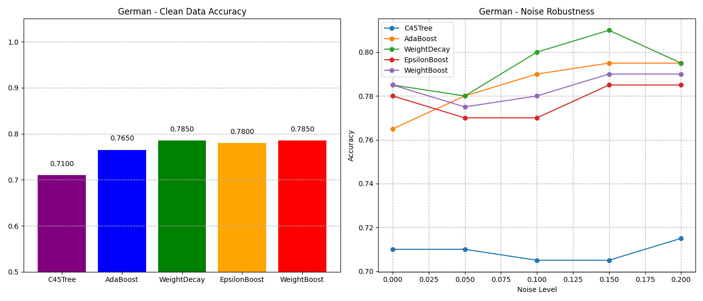
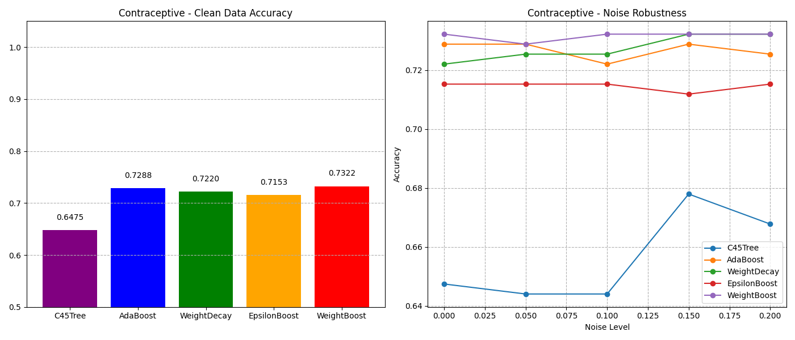

# WeightBoost: A Boosting Algorithm Using Input-Dependent Regularizer

COMP 7404 Project Presentation

---

## Introduction

- Implementation of the WeightBoost algorithm from the paper "A New Boosting Algorithm Using Input-Dependent Regularizer" (Jin et al., 2003)
- Addresses two major limitations of AdaBoost:
  - **Overfitting Problem**: Overemphasis on hard-to-classify samples
  - **Fixed Weight Combination Problem**: Inability to adapt to input patterns

---

## Motivation

- AdaBoost has been highly successful but suffers from two key limitations:
  1. **Noise Sensitivity**: Exponentially increasing weights for misclassified samples can lead to overfitting on noisy data
  2. **Uniform Combination**: Each base classifier contributes equally across all regions of the input space

- WeightBoost introduces an **input-dependent regularizer** that:
  - Adapts the contribution of each classifier based on the input pattern
  - Reduces the influence of base classifiers in regions where the model is already confident
  - Provides better resistance to noisy data

---

## Algorithm Overview

- **Key Innovation**: Input-dependent regularizer
- **Mathematical Formulation**:
  - AdaBoost: $H(x) = \sum_{t=1}^{T} \alpha_t \cdot h_t(x)$
  - WeightBoost: $H_T(x) = \sum_{t=1}^{T} \alpha_t \cdot e^{-\beta|H_{t-1}(x)|} \cdot h_t(x)$

- **Benefits**:
  - Each base classifier contributes only in regions where it performs well
  - Regularization mitigates the impact of noisy data
  - Adaptive to different input patterns

---

## WeightBoost Algorithm

1. Initialize weights: $w_i = \frac{1}{n}$ for all samples
2. Initialize cumulative output: $H_0(x_i) = 0$ for all samples
3. For each iteration $t = 1, 2, ..., T$:
   - Train base classifier $h_t$ with weights $w$
   - Calculate weighted error: $\epsilon_t = \frac{\sum_{i=1}^{n} w_i \cdot \mathbb{1}(h_t(x_i) \neq y_i)}{\sum_{i=1}^{n} w_i}$
   - Compute classifier weight: $\alpha_t = \frac{1}{2} \ln\left(\frac{1-\epsilon_t}{\epsilon_t}\right)$
   - Update cumulative output: $H_t(x_i) = H_{t-1}(x_i) + \alpha_t \cdot h_t(x_i)$
   - Calculate regularization: $r_i = e^{-\beta \cdot |H_t(x_i)|}$
   - Update weights: $w_i = e^{-y_i \cdot H_t(x_i)} \cdot r_i$
   - Normalize weights: $w_i = \frac{w_i}{\sum_{j=1}^{n} w_j}$

---

## Implemented Algorithms

1. **AdaBoost**: Original boosting algorithm (Freund & Schapire, 1996)
2. **Weight Decay**: AdaBoost with weight decay regularization
3. **ε-Boost**: Variant using small fixed weights
4. **WeightBoost**: Novel algorithm with input-dependent regularization
5. **C4.5 Decision Tree**: Base classifier implementation

---

## Datasets

### UCI Datasets (Binary Classification)
- Ionosphere, German Credit, Pima Indians Diabetes
- Breast Cancer (Diagnostic), wpbc, wdbc
- Contraceptive, Spambase

### Reuters-21578 (Text Classification)
- 10,788 news articles (7,769 training, 3,019 testing)
- 90 topic categories (multi-label)
- Used 10 most frequent categories for evaluation

---

## UCI Dataset Preprocessing

- Categorical feature encoding using OrdinalEncoder
- Missing value imputation using SimpleImputer
- Train/test split (80%/20%)
- Label noise injection (0%, 5%, 10%, 15%, 20%)

```python
def encode_categorical(df):
    # Handle missing values and encode categorical features
    num_cols = df.select_dtypes(include=['int64', 'float64']).columns
    cat_cols = df.select_dtypes(include=['object', 'category']).columns
    
    # Impute and encode
    if len(cat_cols) > 0:
        encoder = OrdinalEncoder()
        df[cat_cols] = encoder.fit_transform(df[cat_cols])
    
    return df
```

---

## Reuters Dataset Preprocessing

- Text cleaning (lowercase, punctuation removal, stopwords)
- TF-IDF vectorization (2000 features)
- Multi-label binarization
- Conversion to binary classification problems

```python
# Feature extraction
vectorizer = TfidfVectorizer(max_features=2000)
X = vectorizer.fit_transform(df['cleaned_text'])

# Multi-label encoding
mlb = MultiLabelBinarizer()
y = mlb.fit_transform(df['categories'])
```

---

## Experimental Setup

- **Base Classifier**: C4.5 Decision Tree
- **Number of Estimators**: 50
- **Parameters**:
  - WeightBoost: β = 0.5
  - Weight Decay: C = 0.1
  - ε-Boost: ε = 0.1
- **Metrics**: Accuracy (UCI), F1-score (Reuters)
- **Noise Levels**: 0%, 5%, 10%, 15%, 20% (UCI only)

---

## UCI Results: German Credit Dataset

- WeightBoost outperforms AdaBoost at all noise levels
- The performance gap widens as noise increases
- Input-dependent regularization effectively mitigates noise impact



---

## UCI Results: Pima Indians Diabetes

- WeightBoost maintains better performance as noise increases
- AdaBoost performance degrades more rapidly with noise
- WeightBoost shows more stable performance across noise levels


---

## UCI Results: Contraceptive Dataset

- WeightBoost significantly outperforms all other algorithms
- Shows the advantage of input-dependent regularization on complex datasets
- Maintains performance advantage even with 20% noise



---

## UCI Results: Spambase Dataset

- All algorithms perform well on clean data
- WeightBoost maintains higher accuracy as noise increases
- Shows the practical benefit for real-world applications like spam filtering


---

## Reuters Results: F1 Scores

| Category | C4.5 | AdaBoost | AdaBoost Impro | WeightBoost | WeightBoost Impro |
|----------|------|----------|---------------|-------------|-------------------|
| trade    | 0.5932 | 0.6578 | 10.89% | 0.6855 | 15.56% |
| grain    | 0.9110 | 0.8639 | -5.20% | 0.9024 | -0.90% |
| crude    | 0.7933 | 0.7867 | -0.80% | 0.8315 | 4.80% |
| corn     | 0.7748 | 0.8496 | 3.70% | 0.8036 | 9.70% |
| money-fx | 0.6779 | 0.6854 | 1.11% | 0.7514 | 9.60% |

---

## Reuters Results: Key Findings

- WeightBoost achieves highest F1-scores on 7 out of 10 categories
- Significant improvements on:
  - trade (15.56%)
  - corn (9.70%)
  - money-fx (9.60%)
- More consistent performance compared to AdaBoost

---

## WeightBoost Implementation

```python
def fit(self, X, y):
    n_samples = X.shape[0]
    w = np.ones(n_samples) / n_samples  # Initialize weights
    H = np.zeros(n_samples)  # Cumulative classifier output
    
    for t in range(self.n_estimators):
        # Train base classifier
        model = clone(self.base_classifier)
        model.fit(X, y, sample_weight=w)
        
        # Calculate weighted error and model weight
        pred = model.predict(X)
        err = np.sum(w * (pred != y)) / np.sum(w)
        alpha = 0.5 * np.log((1 - err) / max(err, 1e-10))
        
        # Update cumulative output
        H += alpha * pred
        
        # Calculate regularization factor and update weights
        reg = np.exp(-np.abs(self.beta * H))
        w = np.exp(-y * H) * reg  # Apply regularization
        w = w / np.sum(w)  # Normalize
```

---

## Theoretical Analysis

- **Regularization Effect**: The term $e^{-\beta|H_{t-1}(x)|}$ decreases as $|H_{t-1}(x)|$ increases
  - When $|H_{t-1}(x)|$ is large (high confidence), the regularizer reduces the contribution
  - When $|H_{t-1}(x)|$ is small (low confidence), the regularizer allows more contribution

- **Adaptive Learning**: The algorithm focuses more on uncertain regions and less on regions where it's already confident

- **Noise Resistance**: By reducing the influence in high-confidence regions, the algorithm is less likely to overfit to noisy samples

---

## Conclusion

- **Improved Robustness**: Better resistance to noise
- **Better Generalization**: Prevents overfitting
- **Consistent Performance**: Across datasets and noise levels

The input-dependent regularizer effectively adapts the contribution of each base classifier based on the input pattern, addressing the limitations of traditional boosting algorithms.

---

## References

1. Jin, R., Liu, Y., Si, L., Carbonell, J., & Hauptmann, A. G. (2003). A New Boosting Algorithm Using Input-Dependent Regularizer. *Proceedings of the Twentieth International Conference on Machine Learning (ICML-2003)*.

2. Freund, Y., & Schapire, R. E. (1996). Experiments with a new boosting algorithm. *Machine Learning: Proceedings of the Thirteenth International Conference*.

3. Friedman, J., Hastie, T., & Tibshirani, R. (1998). Additive logistic regression: a statistical view of boosting. *Annals of statistics*, 28(2), 337-407.
